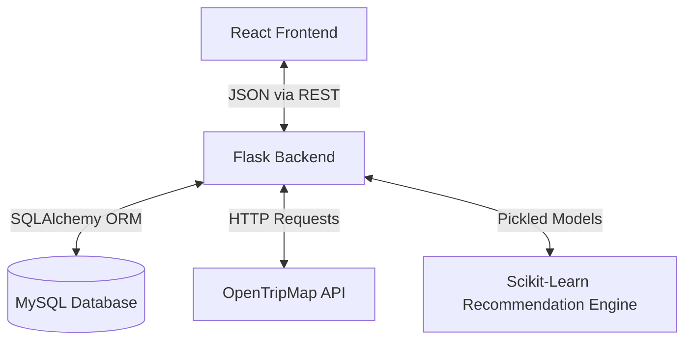

# System Architecture

When I set out to build this Tourism Recommendation System, I wanted an architecture that was robust enough to handle complex Machine Learning logic, but clean enough to easily maintain. I decided on a classic 3-tier decoupled architecture: **React (Frontend)** -> **Flask (Backend API)** -> **MySQL (Database)**, with a dedicated **Scikit-Learn (ML)** layer doing the heavy lifting.

Here is a deep dive into how the pieces fit together.

## The Big Picture

## 1. The Frontend (React)
I chose to build the user interface with **React** (bootstrapped via Vite for lightning-fast builds). A recommendation engine is inherently highly interactive—users are constantly adjusting sliders, toggling activities, and switching between domestic and international options. React's component-based architecture is perfect for this.
- **State Management:** Rather than overengineering the application with Redux, I kept it clean and simple using standard React hooks like `useState` and `useEffect`. Since the state is entirely localized to the recommendation form and the subsequent results page, built-in hooks were more than enough to get the job done efficiently.
- **Styling:** I made a conscious choice to use pure Vanilla CSS. While utility frameworks like Tailwind are popular, writing raw CSS gave me 100% unrestricted control. It allowed me to handcraft the exact micro-animations, glassmorphism effects, and smooth gradients I envisioned, without fighting against predefined classes.
- **Routing:** Navigation between the home page, forms, and results is seamlessly handled by `react-router-dom` to ensure a snappy, single-page application (SPA) experience.

## 2. The Backend (Flask & Python)
When deciding on the backend technology, I went straight for **Flask**. 

By using Flask, I achieved perfect synergy: I can serve high-performance RESTful API endpoints and execute complex Machine Learning vector math in the exact same memory space. This drastically reduces latency and keeps the codebase unified.

I structured the backend using a standard MVC-inspired pattern:
- **Routes**: The entry points. They do nothing but route traffic.
- **Controllers**: Parse incoming JSON and handle HTTP responses.
- **Services**: The "Brain". This is where the core business logic lives (like calling the ML engine or fetching data from the OpenTripMap API).
- **Repositories**: The Data layer. This strictly handles SQLAlchemy queries to keep the DB logic isolated.

## 3. The Recommendation Engine (Machine Learning)
Instead of just doing a basic SQL `WHERE` clause (which is what most basic apps do), I built a custom content based filtering engine.
1. **Vectorization:** When you submit the form, the backend turns your preferences (budget, activities, who you are traveling with) into a heavily weighted text profile.
2. **Cosine Similarity:** It uses a pre-trained `TfidfVectorizer` to convert your profile into a mathematical vector, and then calculates the `cosine_similarity` between your vector and every travel package in the database.

## 4. The Database (MySQL)
I used MySQL because relational data perfectly fits travel packages (Packages have Locations, Locations have Attractions). The database is entirely ephemeral in development Docker automatically builds it and seeds it with dummy data scraped from Kaggle datasets every time you spin it up.

## 5. Docker Infrastructure
To prevent the classic *"it works on my machine"* problem, everything is containerized.
- The React app runs in an Alpine Node container.
- The Flask app runs in a slim Python container.
- The Database runs in the official MySQL container.
They all talk to each other seamlessly over a custom Docker bridge network.
